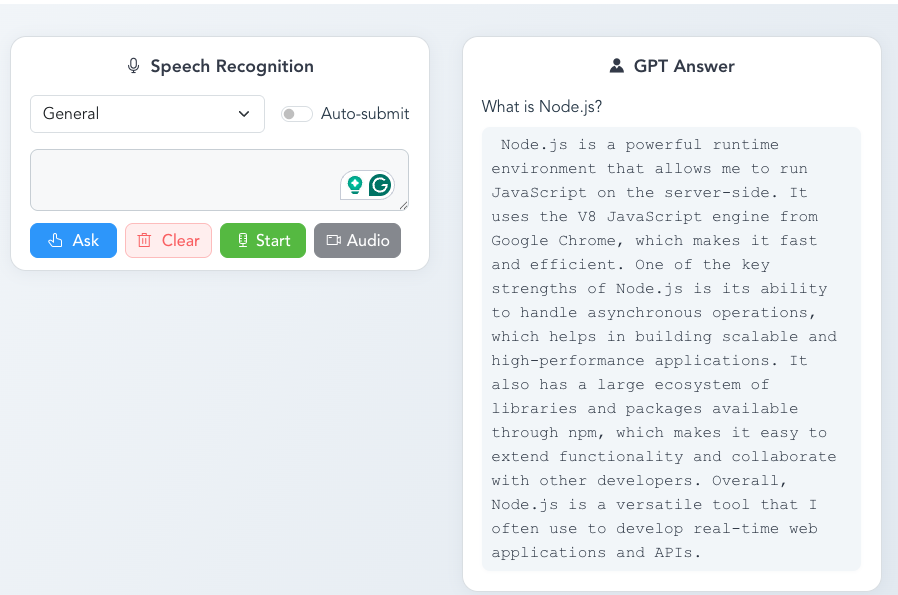
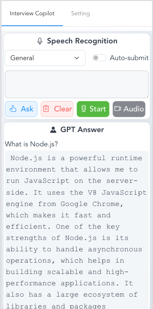

# Interview Assistant

> Utilizing GPT and Microsoft Azure's cutting-edge technology to assist interviewers

This web application captures audio from the microphone, uses Microsoft Azure's speech recognition service to obtain a transcript, and then invokes GPT to generate an answer.

Below are screenshots of the anonymized resume rendered in the browser:

## Setting Instruction

To use GPT, you need an Open AI API Token: https://platform.openai.com

To use Azure's speech recognition service, you can apply for a free token.
## Developing
This project is based on Vue.js.

**Install packages:**

    npm install

**Develop:**

    npm run serve

**Build:**

    npm run build

## Docker

You can also run this project using Docker:

**Build the Docker image:**

    docker build -t interview-pilot .

**Run the Docker container:**

    docker run -p 8080:80 interview-pilot

The app will be available at http://localhost:8080
